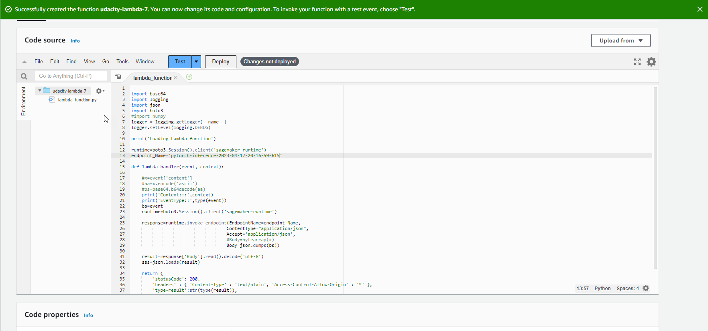

# Operationalizing an AWS ML Project

## Step 1: Training and deployment on Sagemaker

Setup notebook instance (ml.t3.medium selected as it provides sufficient resources and is the lowest in costs)

Create an S3 bucket in AWS workspace

Download data to an S3 bucket

Training jobs

Single-instance training

End point deployment (trained on single instances)

Multiple-instance training

End point deployment (trained on multiple instances)

## Step 2: EC2 Training

EC2 Setup

Training and saving on EC2

 - connect to EC2 terminal

 - download and unzip dogImages

'wget https://s3-us-west-1.amazonaws.com/udacity-aind/dog-project/dogImages.zip'
'unzip dogImages.zip'

 - create TrainedModels folder to store model

'mkdir TrainedModels'

 - edit solution.py with vim program
 
'vim solution.py'
 
 - activate paste
 
':set paste'
 
 - paste code from 'ec2train1.py'
 
 - save file and exit vim
 
'wq!'
 
 - run code
 
 'python solution.py'
 
 - navigate to TrainedModels folder
 
'cd TrainedModels'

 - display concents in TrainedModels folder

'ls'

## Step 3: Lambda function setup

Setup lambda function and add end point deployed in Step 1

## Step 4: Security and testing

Attach security policy to Lambda function

Test Lambda function

## Step 5: Concurrency and auto-scaling

Concurrency

Auto-scaling

