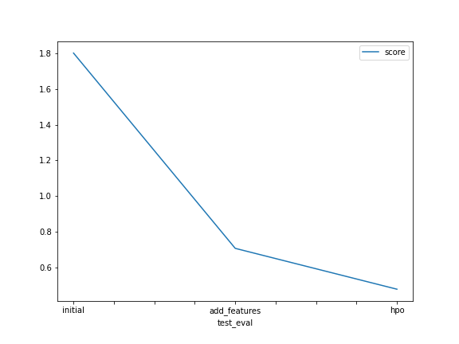
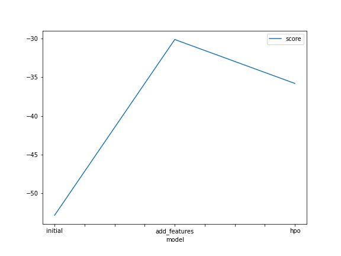

# Report: Predict Bike Sharing Demand with AutoGluon Solution
#### Jared Gan

## Initial Training
### What did you realize when you tried to submit your predictions? What changes were needed to the output of the predictor to submit your results?
I finally realised that for negative numbers were rejected because logically count of bikes in demands can be only 0 or positive integers.
Negative counts in bike demand would not make sense.

### What was the top ranked model that performed?
WeightedEnsemble_L3

## Exploratory data analysis and feature creation
### What did the exploratory analysis find and how did you add additional features?
Exploratory data analysis revealed that it was necessary to parse the datatime feature to datetime datatype.
There is more information to be gained by splitting up the datetime feature into day, hour, month, dayofweek, etc.
Category-based features needed to be properly assigned so that the models "know" that we are working with categorical features and not numerical features.

### How much better did your model preform after adding additional features and why do you think that is?
Significantly better. More relevant parameters = better estimate of functions. Better assignment of categorical and numerical features.

## Hyper parameter tuning
### How much better did your model preform after trying different hyper parameters?
Hpo model is significantly better than initial model but slightly worse off than add_features model.

### If you were given more time with this dataset, where do you think you would spend more time?
Increase the time limit parameter of AutoGluon.
Maybe another model performs better if given enough time.

### Create a table with the models you ran, the hyperparameters modified, and the kaggle score.
|model|hpo1|hpo2|hpo3|score|
|--|--|--|--|--|
|initial|default values|default values|default values|1.80914|
|add_features|default values|default values|default values|0.69503|
|hpo|nn_options{'num_epochs': 10,'learning_rate': ag.space.Real(1e-4, 1e-2, default=5e-4, log=True), 'activation': ag.space.Categorical('relu', 'softrelu', 'tanh'), 'dropout_prob': ag.space.Real(0.0, 0.5, default=0.1)}|gbm_options{'num_boost_round': 100, 'num_leaves': ag.space.Int(lower=26, upper=66, default=36)}|default values|0.48090|

### Create a line plot showing the top model score for the three (or more) training runs during the project.

TODO: Replace the image below with your own.

### Create a line plot showing the top kaggle score for the three (or more) prediction submissions during the project.

TODO: Replace the image below with your own.

## Summary
By using AutoGluon and specifying the parameters time limit and presets, different models can be quickly automatically tested and the "simple" best model can be determined.
AutoGluon automates the menial task of iterating models one at a time.
This saves a lot of time and resources spent iterating on different models to get a good result.